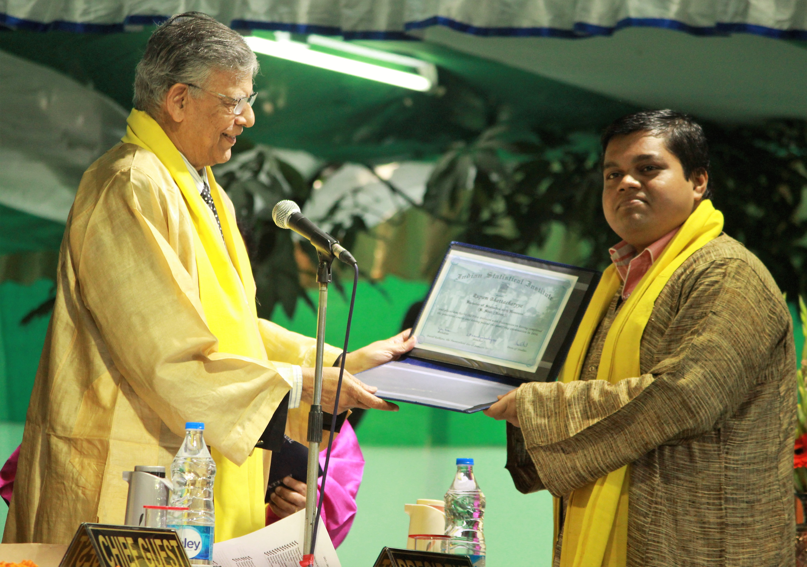

<br>

```{r out.width = "50%", fig.align = "center", echo = FALSE}

```

<br>

Here is an overview of my academic career and teaching activities. For more details on these, please take a look at my [CV](https://drive.google.com/file/d/13CB0IrpY9-GIH-EASHimA5OC9XUgSTPy/view?usp=sharing).

## Education

- **Bachelor of Statistics** (Hons.), Government Titumir College, University of Dhaka; 2018-2022.

## Teaching

- Lecturer at the [**Big Data Summer Institute**](https://sph.umich.edu/bdsi/).
  - [Introduction to Linear Algebra](https://sph.hosted.panopto.com/Panopto/Pages/Viewer.aspx?id=1e37e945-7634-45a2-aba6-aebd01212e07), 2022.
  - [Introduction to Probability](https://sph.hosted.panopto.com/Panopto/Pages/Viewer.aspx?id=f29a5ab0-4ff9-451c-b29e-ad400048d11b), 2021.
- Grader and project reviewer in departmental courses.
  - Biostat 651: Theory And Application Of Generalized Linear Models, Winter 2021.
  - Biostat 802: Advanced Inference II, Winter 2020.