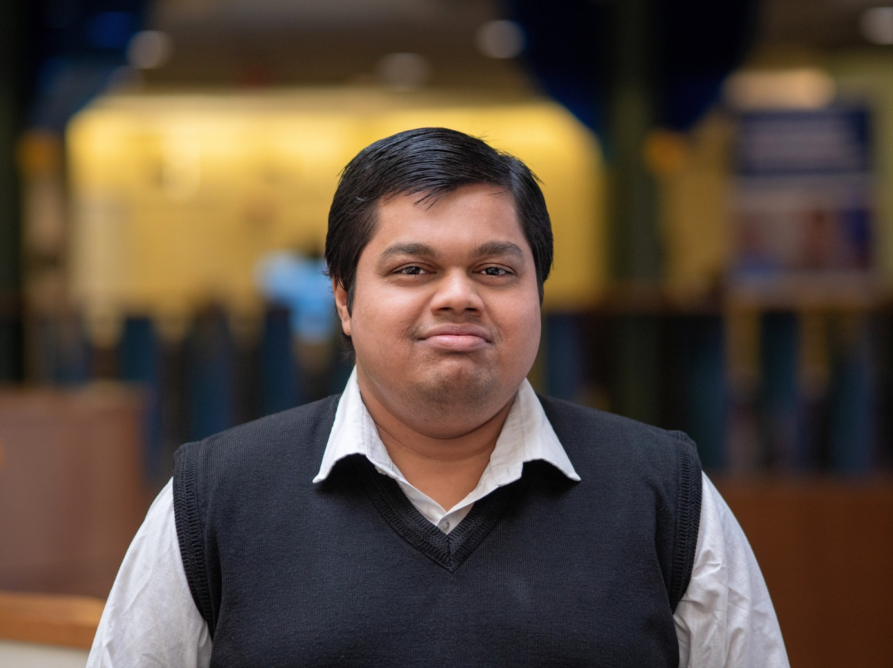

<br>

```{r out.width = "50%", fig.align = "center", echo = FALSE}

```

<br>
Hi! I have completed my bachelor in Statistics and looking for a Ph.D. position. Currently, I am teaching Categorical Data Analysis course, and "Time Series and Biostatistics" lab classes to a group of young statisticians in the Statistics Department, primarily fourth-year undergrads and also working on "epidemiology and associated risk factors with diabetes among the elderly people in Bangladesh: A mixed method approach" with [Mohammad M. Rahman] (https://scholar.google.com/citations?user=IMj8eEcAAAAJ).
Current Research Interest: Machine Learning, Bayesian Deep Learning, Biostatistics, Biomedical Imaging, High Dimensional Data Analysis.

Born in the bucolic countryside of [Magura](https://en.wikipedia.org/wiki/Magura_District)  Khulna, Bangladesh, I spent the larger part of my childhood at Nohata nearby of [Mohammadpur](https://en.wikipedia.org/wiki/Mohammadpur_Upazila), where I did my schooling from [Nohata Rani Patit Paboni High School](https://nohataranipatitapabanisecondaryschool.jessoreboard.gov.bd/) and college from [BAF Shaheen College Dhaka](https://www.bafsd.edu.bd/). I then joined the [Government Titumir College, University of Dhaka](https://7college.du.ac.bd/) to get my bachelor's degree in statistics.

To know more about me, please visit the other corners of this website!