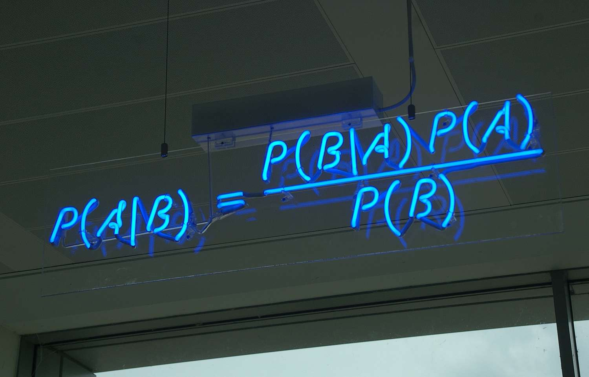

<br>

```{r out.width = "50%", fig.align = "center", echo = FALSE}

```

<br>

I am working on "epidemiology and associated risk factors with diabetes among the elderly people in Bangladesh: A mixed method approach" with [Mohammad M. Rahman](https://scholar.google.com/citations?user=IMj8eEcAAAAJ).

**Current Research Interest:** Machine Learning, Bayesian Statistics, Bayesian Deep Learning, Biostatistics, Biomedical Imaging, High Dimensional Data Analysis

**Skill & Expertise:** Biostatistical Modeling, Categorical Data Analysis, Machine Learning, Econometrics Modeling, Time Series Modeling, Public Health Research, Demographical Modeling, Data Pre-Processing, Cleaning, and Visualization.

Undergraduate project: A study on the Socio-economic Condition of Undergraduate Resident Students of Government Titumir College and Factors of Preferring College Hostel