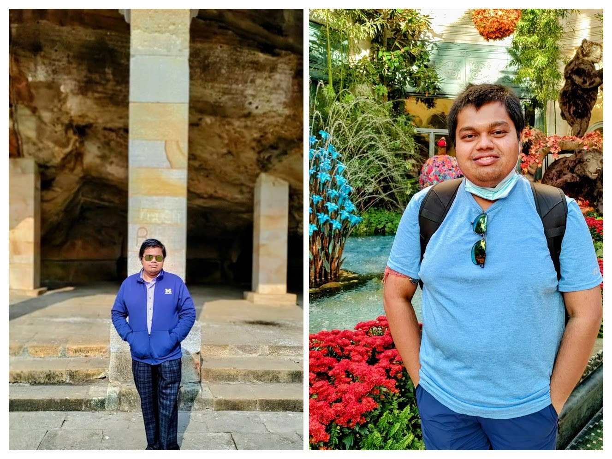

<br>

```{r out.width = "50%", fig.align = "center", echo = FALSE}

```

<br>

## Popular Science and Media Activities

Other than the formal academic ventures, I like to put in efforts behind making the science I work on more accessible and user-friendly to people not necessarily trained in my discipline. Here are a few examples of how I attempt to do so.

- **YouTube Tutorials**
  - Available on the [Talk to Nazmul](https://www.youtube.com/channel/UCHKMxKD5SbK9-RfcqkjfMbg).
