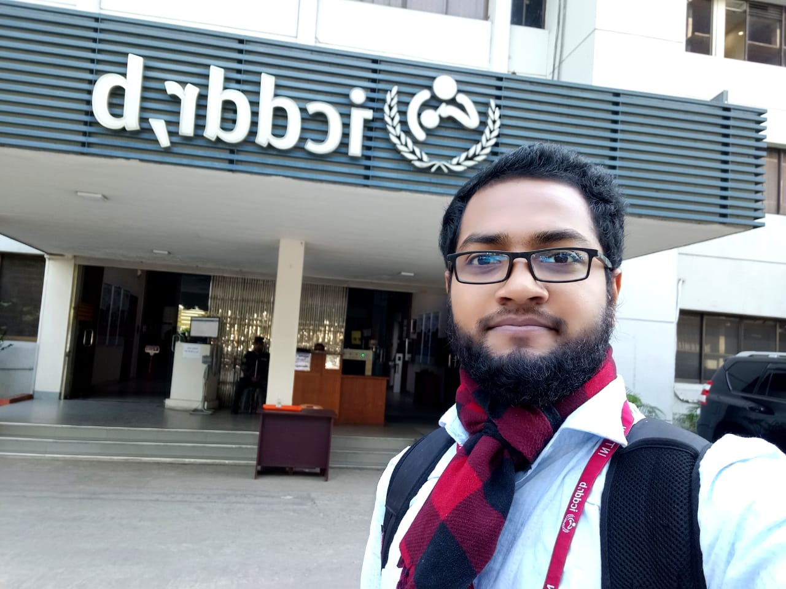

 

|   |  |  |
|:---:|:---:|:---:|
| Internship at icddr,b | Conducted lab classes for the fourth year students | Managed everything for 86 students for a three days long tour as a coordinator |

 

|   |  |  |
|:---:|:---:|:---:|
| Tested blood group, measured blood pressure, and motivated students for donating blood in a day long workshop | Conducted an online session on 'Designing Career Strategy' and talked about the career opportunities for Statistics graduates & how it can be achieved | Learned personal finance management, how to save & where to invest |

 

|   |  |  |
|:---:|:---:|:---:|
| Was selected in the top 42 out of 800+ applicants nationwide, it was focused on sensitizing young students on the values of leadership, teamwork, public speaking, critical thinking, and active citizenship  | Volunteered BYLC's youth carnival event working with Operations, Program executions team; specifically for data entry, phone calls, registrations, crowd management | Promoted BYLC's Building Bridges Through Leadership Training (BBLT) program & motivated the students for learning leadership skills  |

 

|   |  |  |
|:---:|:---:| :---:|
| Arranged a workshop on the 'SAFE ROADS & LIFE' project & created awareness among the school children through games, videos, and acting  | Field work with children | Participated in a workshop led by Everest winner M.A Muhit & won a picture in the questions answering session among 150+ students | 
